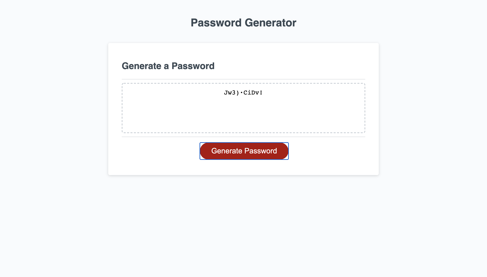

# password-generator

The password generator code was created to assist the User to create a secure password. To be able to use it, the User needs to select some criteria, like the password length, if it needs to have Uppercase, Lowercase, Numbers or Symbols. The program saves those decision in variables, and then make it match with the lenght of the password, once it has all the characters, they randomize and the user get's the password in the text box of the program.

This is a first prototype, the idea is to add a bottom to save the password created in the clipboard, to make it more simple to the user to save the characters.

In the final parts of the code, some parts are commented, this is funcional code that can be added, this was my first attemp before my Tutor help me to make it more simple, the "While" statement was replaced with a "For", and the Event listener was commented, because when it was clicked, a different password was created with the same criteria, but with different characters. Since this was not what the assigment requested, it was changed to make the questions again to create a different password.
